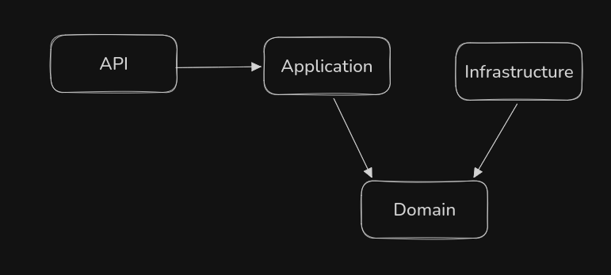

# Task Manager

Aplicação fullstack de gerenciamento de tarefas com board kanban, soft delete e restauro de tarefas removidas.

---

## Funcionalidades
 
**Requisitos funcionais**
- Cadastrar, editar e remover tarefas
- Status por tarefa: Pendente, Em andamento, Concluída e Cancelada
- Filtro por status via board kanban, cada coluna representa um status
- Busca em tempo real por título e descrição
- Visualização em quadro kanban com quatro colunas
 
**Extras**
- Soft delete com restauração, tarefas removidas ficam disponíveis para restaurar
- Política de retenção: `TaskCleanupService` remove permanentemente tarefas deletadas há mais de N dias
- Swagger: documentação interativa da API em `/swagger`
- Docker: banco de dados via `docker compose`
- Testes unitários: `TaskService`, `TaskCleanupService` e domínio puro com xUnit + Moq

---

## Como rodar

### Pré-requisitos

- .NET 10 SDK
- Node.js 22+
- Docker

```bash
dotnet tool install --global dotnet-ef
export PATH="$PATH:$HOME/.dotnet/tools"
```

### 1. Banco de dados

```bash
cd db
docker compose up -d
```

### 2. Backend

```bash
cd backend

# Aplicar migrations (primeira vez)
dotnet ef database update --project src/TaskManager.Infrastructure --startup-project src/TaskManager.API

# Subir a API
dotnet run --project src/TaskManager.API
```

API disponível em `http://localhost:5000`  
Swagger em `http://localhost:5000/swagger`

#### Rodar testes:

```bash
dotnet test
```


### 3. Frontend

```bash
cd frontend/front-TaskManager
npm install
npm start
```

Frontend disponível em `http://localhost:4200`

---

## Arquitetura

O projeto segue um **DDD leve** com separação clara de responsabilidades em ambas as frentes. A regra central é a **Dependency Rule**: camadas externas conhecem as internas, nunca o contrário.


---

## Backend

Organizado em quatro projetos dentro de `backend/src/`:

```
TaskManager.Domain           núcleo, zero dependências externas
TaskManager.Application      casos de uso e contratos
TaskManager.Infrastructure   EF Core, Postgres, repositórios
TaskManager.API              controllers, Swagger, injeção de dependência
```

### Domain

Contém as entidades e regras de negócio. Não conhece banco de dados, HTTP ou qualquer framework.

`TaskItem` é o aggregate root, toda mutação de estado passa pelos seus métodos:

```csharp
TaskItem.Create(title, description)   // factory método, única forma de criar
task.Update(title, description)
task.ChangeStatus(status)             // valida enum antes de mudar
task.SoftDelete()                     // marca IsDeleted=true, registra DeletedAtUtc
task.Restore()                        // reverte o soft delete
task.CanBePermanentlyDeleted(days)    // regra de retenção encapsulada no domínio
```

Setters privados garantem que o estado só muda via métodos explícitos, nenhuma camada externa consegue fazer `task.Status = X` diretamente.

### Application

Orquestra os casos de uso. Depende apenas de interfaces (`ITaskRepository`) definidas aqui mesmo, a implementação fica na Infrastructure. Isso é o **Dependency Inversion** do SOLID: a camada de alto nível não depende de detalhes concretos.

`TaskService` implementa os casos de uso: criar, buscar, atualizar, deletar (soft), restaurar e listar deletadas.

`TaskCleanupService` encapsula a política de retenção: tarefas com `IsDeleted=true` há mais de N dias são removidas permanentemente, essa lógica não vaza para controllers nem repositórios.

### Infrastructure

Implementa os contratos do Application usando EF Core + Postgres.

`TaskItemConfiguration` configura o schema via Fluent API:
- `HasQueryFilter(x => !x.IsDeleted)` todas as queries padrão ignoram tarefas deletadas automaticamente
- Índices em `Status`, `CreatedAtUtc` e `(IsDeleted, DeletedAtUtc)` para performance

`TaskRepository` usa `IgnoreQueryFilters()` nos métodos que precisam enxergar registros deletados (`GetByIdIgnoringFiltersAsync`, `GetAllDeletedAsync`, `GetSoftDeletedOlderThanAsync`).

### API

Controllers finos — recebem a request, delegam ao service, retornam o resultado. Nenhuma lógica de negócio vive aqui.

| Método | Endpoint | Descrição |
|--------|----------|-----------|
| GET | `/api/tasks` | Lista tarefas ativas (filtro por status opcional) |
| GET | `/api/tasks/deleted` | Lista tarefas soft-deleted |
| GET | `/api/tasks/{id}` | Busca tarefa por id |
| POST | `/api/tasks` | Cria tarefa |
| PUT | `/api/tasks/{id}` | Atualiza tarefa |
| DELETE | `/api/tasks/{id}` | Soft delete |
| PATCH | `/api/tasks/{id}/restore` | Restaura tarefa deletada |

### Banco de dados

Postgres com Schema gerenciado pelo EF Core Migrations.

```
Task_items
├── Id             uuid, PK
├── Title          varchar(200), NOT NULL
├── Description    varchar(2000), nullable
├── Status         int (0=Pending, 1=InProgress, 2=Done, 3=Canceled)
├── IsDeleted      boolean, default false
├── DeletedAtUtc   timestamptz, nullable
├── CreatedAtUtc   timestamptz
└── UpdatedAtUtc   timestamptz
```

### Testes

Testes unitários em `backend/tests/TaskManager.UnitTests/` com xUnit + Moq.

Cobertura: `TaskService`, `TaskCleanupService` e `TaskItem` (domínio puro).

`MockBehavior.Strict` nos mocks — qualquer chamada não configurada falha o teste, evitando falsos positivos.

---

## Frontend

Angular 21 com standalone components e Signals. Organizado em quatro camadas espelhando o backend:

```
src/app/
├── domain/         — tipos e contratos (task.model.ts)
├── data/           — HTTP (task.repository.ts)
├── application/    — estado e casos de uso (task.service.ts)
└── presentation/   — componentes Angular (task-list, task-form)
```

### Domain

`task.model.ts` define os tipos que transitam pela aplicação. É o contrato entre frontend e backend, se o backend mudar um campo, o TypeScript aponta tudo que quebrou.

### Data

`TaskRepository` é o único arquivo que conhece a URL da API e o `HttpClient`. Nenhum componente faz requisições HTTP diretamente, isolando a infraestrutura.

### Application

`TaskService` gerencia estado com signals.

No `loadAll()`, `forkJoin` executa `GET /tasks` e `GET /tasks/deleted` em paralelo, sem isso as deletadas sumiam no reload porque o backend filtra `IsDeleted=true` por padrão.

O estado da página muda imediatamente no signal, sem esperar nova uma request. Em caso de erro do backend, a mensagem é exibida via o signal error e o dado é recarregado no próximo `loadAll()`.

### Presentation

`TaskListComponent`, quadro kanban com quatro colunas (uma por status). `tasksForStatus(status)` filtra o array local em memória, sem nova request, sem estado de filtro extra. Seção colapsável de tarefas removidas com botão de restaurar.

`TaskFormComponent`, modal reutilizável para criar e editar. Recebe `task` como `@Input()` (null = criar, objeto = editar) e emite eventos `submitted` e `cancelled`, não sabe de HTTP, não sabe de estado global.

Campo de busca filtra por título e descrição em tempo real via `filteredActiveTasks`, um `computed()` derivado do estado central

### Estilos

SCSS com `_variables.scss` centralizado, tokens de cor, espaçamento, tipografia e breakpoints definidos uma vez e importados nos componentes. Mixins em `styles.scss` para padrões repetidos (`flex-between`, `button-reset`, `card-base`, `respond-to`).

